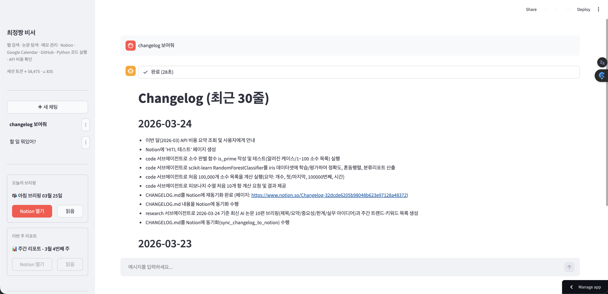
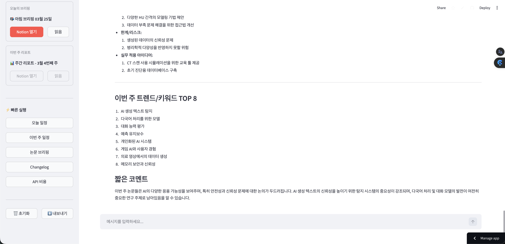
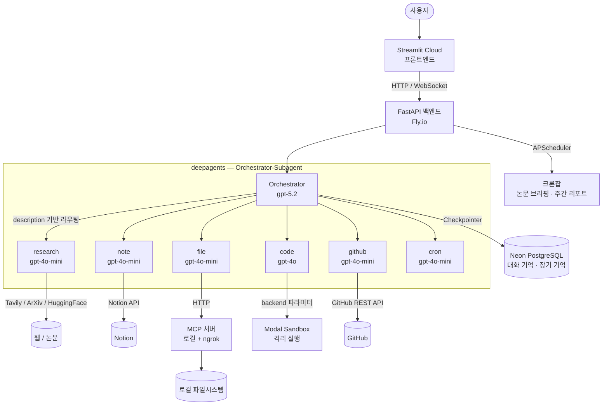

# My Personal Assistant (MPA)

[Deepagents](https://github.com/langchain-ai/deepagents)(LangChain + LangGraph)로 구현한 개인 AI 비서.<br/>
[OpenClaw](https://docs.openclaw.ai/)의 Orchestrator-Subagent 패턴을 참고해 웹 검색, 논문 탐색, 코드 실행, GitHub, Notion, 캘린더를 하나의 채팅창에서 제공


---

**채팅 UI** — 사이드바(대화 목록·빠른 실행·브리핑 링크), CHANGELOG 자동 기록, 서브에이전트 진행 상태 표시



**논문 브리핑** — 매일 오전 10시 자동 실행, 주간 트렌드 키워드 및 코멘트 포함



---

## 주요 기능

| 기능 | 설명 |
|------|------|
| 로컬 파일 분석 | MCP 서버 + ngrok 터널로 로컬 파일 읽기 |
| 코드 실행 | Modal 클라우드 샌드박스에서 Python 코드 격리 실행 |
| 웹 검색 | Tavily API 기반 최신 정보 검색 |
| 논문 탐색 | ArXiv · HuggingFace Daily Papers 수집 및 요약 |
| Notion 관리 | 페이지 검색·조회·생성·수정 |
| GitHub 관리 | 이슈·PR 조회, 이슈 생성·댓글 (HITL) |
| 자동 브리핑 | 매일 10:00 논문 브리핑, 매주 금요일 17:00 주간 리포트 |
| 장기 기억 | 비서 이름, 사용자 선호도 등 DB에 영구 저장 |
| CHANGELOG | 작업 완료 시 자동으로 CHANGELOG.md 기록 + Notion 동기화 |
| API 비용 확인 | 이번 달 OpenAI API 사용 비용 조회 |

---

## 아키텍처

### 기술 스택

| 역할 | 기술                                                                                |
|------|-----------------------------------------------------------------------------------|
| 에이전트 | [Deepagents](https://github.com/langchain-ai/deepagents) (LangChain + LangGraph) |
| 백엔드 | FastAPI + APScheduler                                                             |
| 프론트엔드 | Streamlit                                                                         |
| DB | PostgreSQL (Neon) - SQLite 로컬 폴백도 가능                                              |
| 코드 실행 | Modal Sandbox                                                                     |
| 파일 접근 | fastmcp + ngrok                                                                   |
| 배포 | Fly.io + Streamlit Cloud + GitHub Actions                                         |

### 전체 구조



---

## OpenClaw 아이디어 → deepagents 구현

| OpenClaw 아이디어 | MPA 구현 | deepagents 기능 |
|---|---|---|
| Orchestrator-Subagent 라우팅 | description 기반 자동 라우팅 | `create_deep_agent(subagents=[...])` |
| HITL (쓰기 전 확인) | 오케스트레이터 레벨 | `interrupt_on=HITL_TOOLS` |
| 코드 실행 샌드박스 | Modal Sandbox | `backend=_make_sandbox_factory()` |
| 파일 접근 | MCP 서버 + ngrok | `FilesystemBackend` 대신 교체 |
| 비서 이름 짓기 (장기 기억) | `save_memory` → PostgreSQL | `StoreBackend` / `AGENTS.md` 대신 DB + 커스텀 툴 직접 구현 |
| 자동 브리핑 크론잡 | APScheduler | deepagents 크론 미지원 — FastAPI lifespan + APScheduler 직접 구현 |

**LangGraph 직접 구현 대신 deepagents를 쓴 이유**

| LangGraph 직접 구현 | deepagents |
|---------------------|------------|
| StateGraph · 노드 · 엣지 수동 정의 | `create_deep_agent()` 한 줄 |
| 라우팅 로직 직접 작성 | LLM이 `description` 읽고 자동 판단 |
| ~100줄+ 보일러플레이트 | 선언적 dict 구조 |

```python
# LangGraph 직접 구현 시 필요한 반복 코드
graph = StateGraph(MessagesState)
graph.add_node("agent", agent_node)
graph.add_node("tools", tool_node)
graph.add_edge("agent", "tools")
graph.add_conditional_edges("tools", should_continue)
graph.set_entry_point("agent")
compiled = graph.compile(checkpointer=checkpointer)

# deepagents — 위와 동일한 그래프를 한 줄로
agent = create_deep_agent(model="openai:gpt-5.2", tools=[...], subagents=[...])
```

---

## 배포 구조

| 서비스 | 플랫폼 | 비용 | 선택 이유 |
|--------|--------|------|-----------|
| 프론트엔드 | Streamlit Cloud | 무료 | Python 서버 무료 배포, GitHub 자동 배포 |
| 백엔드 | Fly.io | ~$2/월 | 크론잡 24/7, Docker, WebSocket |
| DB | Neon PostgreSQL | 무료 | 비활성 슬립, dev/prod 기억 공유 |
| 코드 실행 | Modal | 무료 ($5/월 크레딧) | 격리 샌드박스, 자동 확장 |
| 파일 접근 | 로컬 + ngrok | 무료 | 클라우드 서버에서 로컬 파일 접근 |

---

## 설치 및 실행

### 요구사항
- Python 3.13+
- [uv](https://docs.astral.sh/uv/)
- [ngrok](https://ngrok.com/) (로컬 파일 접근 시)

### 로컬 실행

```bash
# 의존성 설치
uv sync

# 환경변수 설정
cp .env.example .env
# .env 파일에 API 키 입력

# 프론트엔드 (채팅만 필요하면 이것만)
uv run streamlit run frontend/app.py --server.port 8001

# 백엔드 (자동 브리핑·리포트 필요 시 추가 실행)
uv run uvicorn backend.app:app --reload --port 8000

# MCP 서버 (로컬 파일 접근 시)
./scripts/start_mcp.sh

# 종료
./scripts/stop_mcp.sh
```

> **주의**: MCP 서버는 로컬에서 실행되어야 합니다.
> 파일 접근이 필요할 때만 실행하면 되며, 꺼져 있어도 검색·메모·논문 등 다른 기능은 정상 동작합니다.

---

## 환경변수

`.env.example`을 복사해 `.env`를 만들고 아래 값을 채우세요.

| 변수 | 필수 | 설명 |
|------|------|------|
| `OPENAI_API_KEY` | ✅ | OpenAI API 키 |
| `TAVILY_API_KEY` | ✅ | Tavily 검색 API 키 ([무료 1,000회/월](https://tavily.com)) |
| `DATABASE_URL` | | Neon PostgreSQL 연결 문자열 (없으면 SQLite 자동 사용) |
| `MCP_SERVER_URL` | ✅ | MCP 서버 URL (dev: `http://localhost:8002`, prod: ngrok URL) |
| `MCP_AUTH_TOKEN` | ✅ | MCP 서버 인증 토큰 |
| `GITHUB_TOKEN` | | GitHub Personal Access Token |
| `GOOGLE_CLIENT_ID` | | Google OAuth 클라이언트 ID |
| `GOOGLE_CLIENT_SECRET` | | Google OAuth 클라이언트 시크릿 |
| `GOOGLE_REFRESH_TOKEN` | | Google 리프레시 토큰 (`scripts/get_google_token.py` 실행 후 발급) |
| `NOTION_API_KEY` | | Notion Integration 토큰 |
| `NOTION_DEFAULT_PARENT_PAGE_ID` | | Notion 페이지 생성 시 기본 상위 페이지 UUID |
| `NOTION_CHANGELOG_PAGE_ID` | | CHANGELOG 동기화할 Notion 페이지 ID |
| `NOTION_BRIEFING_PARENT_PAGE_ID` | | 아침 브리핑 저장할 상위 페이지 ID |
| `NOTION_REPORT_PARENT_PAGE_ID` | | 주간 리포트 저장할 상위 페이지 ID |
| `ENV` | | `development` \| `production` (기본: development) |
| `PORT` | | 백엔드 포트 (기본: 8000) |

---

## CI / 코드 품질 검증

로컬에서 먼저 검증:

```bash
uv run mypy .                               # 타입 체크
uv run ruff check . && uv run ruff format . # 린트 + 포맷
uv run pytest tests/ -v                     # 단위 테스트
```

main 브랜치에 push하면 GitHub Actions가 순서대로 실행:

```
lint-and-test (PR · push 공통)
  ├── ruff check    — 코드 스타일/품질
  ├── ruff format   — 포맷 일관성
  ├── mypy          — 타입 체크
  └── pytest        — 단위 테스트

deploy (main push 시에만, lint-and-test 통과 후)
  └── flyctl deploy → Fly.io 자동 배포
```
