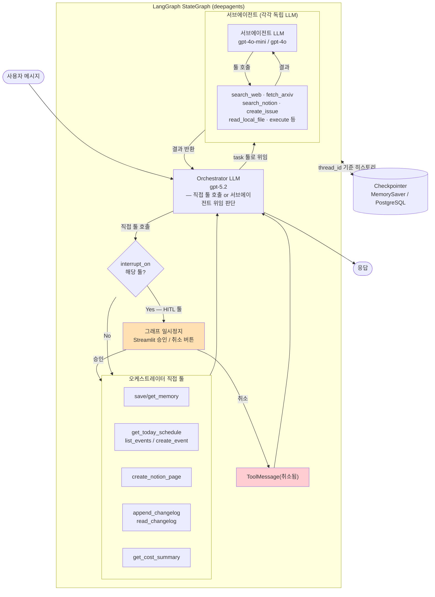

# My Personal Assistant — 발표 슬라이드 초안

---

## Slide 1 — 프로젝트 소개

### My Personal Assistant (MPA)
**deepagents로 만든 나만의 AI 개인 비서**

- OpenClaw(개인 비서 프레임워크)에서 영감 → deepagents(LangGraph 추상화)로 구현
- 웹 검색 · 논문 탐색 · 코드 실행 · GitHub · Notion · 캘린더, 모두 하나의 채팅창에서

**만든 이유**
> "AI 논문은 ArXiv에서, 메모는 Notion에서, 일정은 캘린더에서…
> 매일 여러 도구를 왔다갔다 하는 게 불편했다."

**데모**: https://mypersonalassistant-epcfckkzuvkjf6cwmmivk5.streamlit.app/

---

## Slide 2 — OpenClaw에서 영감, deepagents로 구현

**OpenClaw**: Orchestrator-Subagent 패턴의 개인 비서 프레임워크

**OpenClaw에서 가져온 아이디어**
- Orchestrator가 요청을 받아 적절한 서브에이전트에 위임
- 비서 이름 짓기 (장기 기억)
- 자동 브리핑 크론잡

**OpenClaw 기능 구현 현황**

| OpenClaw 기능 | MPA | 비고 |
|---|---|---|
| Orchestrator-Subagent 라우팅 | ✅ | deepagents `subagents` |
| 단기 기억 | ✅ | deepagents `checkpointer` |
| 장기 기억 | ✅ | deepagents 미사용 — 커스텀 save_memory 툴 + DB 직접 구현 |
| HITL | ✅ | 오케스트레이터 레벨만 동작 |
| 코드 실행 샌드박스 | ✅ | deepagents `backend` → Modal |
| 파일 접근 | ✅ | deepagents 내장 대신 MCP |
| 크론잡 | ✅ (하드코딩) | 동적 등록 불가 — 개선점 |
| Skills (`SKILL.md`) | ❌ | system_prompt 하드코딩으로 대체 |
| 대화 요약/압축 | ❌ | deepagents `SummarizationMiddleware` 미사용 — 개선점 |
| 멀티채널 | ❌ | Streamlit만 — 개선점 (Telegram 동시 연결 가능) |
| 토큰 캐싱 | ❌ | `AnthropicPromptCachingMiddleware` 미사용 |

**deepagents로 구현한 이유**

| LangGraph 직접 구현 | deepagents |
|---------------------|------------|
| StateGraph, 노드, 엣지 수동 정의 | `create_deep_agent()` 한 줄 |
| 라우팅 로직 직접 작성 | LLM이 description 읽고 자동 판단 |
| ~100줄+ 보일러플레이트 | 선언적 dict 구조 |

> 사내 deepagents 세미나 → 실제 프로젝트에 적용

---

## Slide 3 — 무엇을 할 수 있나

| 기능 | 예시 |
|------|------|
| 웹 검색 · AI 뉴스 | "RAG 최신 트렌드 알려줘", "LangGraph vs AutoGen 비교해줘" |
| 논문 탐색 | "HuggingFace 오늘 인기 논문 알려줘", "ArXiv MoE 논문 찾아줘" |
| Notion 관리 | "Notion에서 RAG 페이지 찾아줘", "주간 회고 페이지 만들어줘" |
| Google Calendar | "오늘 일정 알려줘", "다음 주 월요일 오후 3시 미팅 잡아줘" |
| GitHub | "내 이슈 목록", "내 PR", "할일 뭐 있어?" |
| Python 코드 실행 | "피보나치 100번째 숫자 계산해줘", "행렬 SVD 분해해줘" |
| 로컬 파일 분석 | "~/projects/my-app/main.py 읽어줘" |
| 장기 기억 | "내 주력 언어는 Python이야 기억해줘", "너 이름은 아리야" |
| 자동 크론 | 매일 오전 10시 논문 브리핑 · 매주 금요일 주간 리포트 |

---

## Slide 4 — 전체 아키텍처

```
사용자
  │
  ▼
Streamlit Cloud (프론트엔드)
  │  HTTP
  ▼
FastAPI 백엔드 (Fly.io)
  │
  ▼
Orchestrator — gpt-5.2
  ├── research  (gpt-4o-mini)  웹 검색 · 논문
  ├── note      (gpt-4o-mini)  Notion
  ├── file      (gpt-4o-mini)  로컬 파일 ──→ MCP 서버 (로컬 + ngrok)
  ├── code      (gpt-4o)       코드 실행 ──→ Modal Sandbox
  ├── github    (gpt-4o-mini)  GitHub
  └── cron      (gpt-4o-mini)  자동 브리핑
        │
        ▼
   Neon PostgreSQL
   (대화 기억 · 장기 기억)
```

---

## Slide 5 — Orchestrator-Subagent 패턴 (deepagents 핵심)

**라우팅 코드가 없다** — deepagents가 LLM에게 위임

```python
# create_deep_agent() — deepagents API
agent = create_deep_agent(
    model="openai:gpt-5.2",
    subagents=[RESEARCH_SUBAGENT, NOTE_SUBAGENT, FILE_SUBAGENT,
               CODE_SUBAGENT, GITHUB_SUBAGENT, CRON_SUBAGENT],
    interrupt_on=HITL_TOOLS,   # 쓰기 작업 전 사용자 확인
    checkpointer=checkpointer, # 대화 히스토리 영속화
)
```

```python
# LLM이 이 description을 읽고 언제 호출할지 판단
GITHUB_SUBAGENT = {
    "description": "GitHub 관련 작업이 필요할 때 사용. "
                   "담당 이슈 조회, PR 목록, 이슈 생성·댓글...",
    "tools": [list_my_issues, list_my_prs, create_issue, ...],
}
```

**서브에이전트별 모델 선택**
- Orchestrator: `gpt-5.2` — 복잡한 라우팅 판단
- 서브에이전트: `gpt-4o-mini` — 단순 실행, 비용 최적화
- code 서브에이전트만: `gpt-4o` — 코드 생성 품질

---

## Slide 6 — 에이전트 내부 실행 흐름



---

## Slide 7 — 툴 설계: docstring이 곧 API 문서

LLM이 툴을 선택하는 기준 = **docstring**

```python
def save_memory(key: str, value: str) -> str:
    """사용자 정보나 선호도를 장기 기억에 저장한다.
    나중에 다시 참조할 정보에 사용."""

def append_changelog(summary: str, files: str | None = None) -> str:
    """CHANGELOG.md에 오늘 날짜로 작업 내역을 기록한다.
    코드 실행, 파일 수정/생성, 중요한 작업 완료 시 호출한다."""
```

**툴은 그냥 Python 함수**
- 언제 호출할지 → LLM이 docstring 읽고 판단
- 파라미터에 뭘 넣을지 → LLM이 타입 힌트 + docstring 보고 결정
- docstring이 나쁘면 → 툴을 안 쓰거나 잘못 씀

---

## Slide 8 — 두 종류의 기억

```
단기 기억 (대화 히스토리)
  LangGraph Checkpointer  ← deepagents checkpointer 파라미터
  ├── 로컬: MemorySaver (메모리, 재시작 시 초기화)
  └── 배포: AsyncPostgresSaver (Neon PostgreSQL, 영구 유지)
  → thread_id로 대화 세션 구분

장기 기억 (영구 저장)
  save_memory("assistant_name", "클로드")
  → DB INSERT / UPSERT
  → 대화가 끊겨도, 새 세션에서도 유지
  → get_memory()로 언제든 호출
```

**실제 동작 예시**
```
사용자: "너 이름은 아리야"
비서:   save_memory("assistant_name", "아리") 호출
        → 다음 대화, 재시작 후에도 "아리"로 기억
```

**CHANGELOG 자동 기록**

작업 완료 시 오케스트레이터가 `append_changelog` 직접 호출 — 에이전트가 LLM 판단으로 결정

| 호출 기준 |
|----------|
| 코드 실행 · 파일 생성/수정 |
| 논문 브리핑 · 주간 리포트 생성 |
| 메모 · 캘린더 · 이슈 · Notion 페이지 생성 |

```
append_changelog("fibonacci 계산 실행")
  → CHANGELOG.md에 날짜별 누적 기록
  → Notion 페이지 자동 동기화 (NOTION_CHANGELOG_PAGE_ID 설정 시)
```

---

## Slide 9 — HITL (Human-in-the-Loop)

**OpenClaw는 완전 자율 — MPA는 쓰기 전에 확인**

```python
# deepagents interrupt_on 파라미터
HITL_TOOLS = {
    "create_event": True,        # 캘린더 일정 생성
    "create_notion_page": True,  # Notion 페이지 생성
}

# 서브에이전트 레벨 — GitHub 쓰기 작업
"interrupt_on": {
    "create_issue": True,
    "comment_on_issue": True,
}
```

**HITL 동작 범위**
- 오케스트레이터 레벨 `interrupt_on`만 실제 동작 확인: `create_event`, `create_notion_page`
- 서브에이전트 레벨 `interrupt_on`은 인터럽트가 툴 오류로 처리되어 미동작 — 개선 필요

**동작 흐름**
```
에이전트가 create_event 호출 시도
  → LangGraph 그래프 실행 일시정지
  → Streamlit에 "승인 / 취소" 버튼 표시
  → 승인: ainvoke(None) 으로 재개
  → 취소: ToolMessage("취소됨") 주입 후 재개
```

> "읽기는 자동, 쓰기는 확인" 원칙

---

## Slide 10 — MCP 서버 & 보안

**deepagents 기본값 교체 1 — 파일 접근**
- 기본 `read_file`은 서버(Fly.io) 파일시스템을 읽음 → 로컬 맥북 파일 접근 불가
- 내장 툴 사용 금지 + 로컬 MCP 서버 + ngrok 터널로 교체

```
맥북 MCP 서버 (port 8002)
  └→ ngrok 고정 도메인
       └→ Fly.io file 서브에이전트가 HTTP 요청
```

**보안 이중화**

```yaml
# mcp_server/config.yaml
deny:    # 읽기 자체를 차단 (.env, *.key)
ignore:  # 목록에서만 숨김 (.venv, .git)
```

| | deny | ignore |
|--|------|--------|
| 목록에 표시 | X | X |
| 파일 읽기 | X | O |

---

## Slide 11 — 코드 실행: Modal Sandbox

**deepagents 기본값 교체 2 — 코드 실행**
- 기본 `execute`는 Fly.io 서버에서 직접 실행 → 내 맥북 환경 없음, 서버 터뜨릴 위험
- `backend=ModalSandbox`로 교체 → Modal 격리 컨테이너에서 실행

```python
# deepagents backend 파라미터로 교체
create_deep_agent(backend=_make_sandbox_factory(), ...)

# 팩토리 클로저 — 샌드박스 재사용 + 만료 시 자동 재생성
def _make_sandbox_factory():
    _sandbox = None
    def factory(runtime):
        if not _is_alive(_sandbox):
            _sandbox = modal.Sandbox.create(...)
        return ModalSandbox(sandbox=_sandbox)
    return factory
```

**동작 예시**
```
사용자: "피보나치 100번째 숫자 계산해줘"
에이전트: /root/script.py 작성 → execute("python /root/script.py") → 결과 반환
```

---

## Slide 12 — 배포 구조

| 서비스 | 플랫폼 | 비용 | 선택 이유 |
|--------|--------|------|-----------|
| 프론트엔드 | Streamlit Cloud | 무료 | Python 서버, GitHub 자동 배포 |
| 백엔드 | Fly.io | ~$2/월 | 24/7 크론잡, Docker, WebSocket |
| DB | Neon PostgreSQL | 무료 | 비활성 슬립, dev/prod 기억 공유 |
| 코드 실행 | Modal | 무료 ($5/월 크레딧) | 격리 샌드박스, 자동 확장 |
| 파일 접근 | 로컬 + ngrok | 무료 | 로컬 파일을 외부에 안전하게 노출 |

**Streamlit 웹 UI를 선택한 이유 — 텔레그램 봇이 아닌 이유**

텔레그램 봇은 채팅창 하나만 있는 구조 — 추가 UI를 붙일 수 없음

| 필요한 기능 | 텔레그램 봇 | Streamlit |
|------------|------------|-----------|
| 추천 질문 버튼 | 제한적 | ✅ 자유 배치 |
| 브리핑 / 리포트 탭 | ❌ | ✅ |
| HITL 승인/취소 버튼 | 제한적 | ✅ |
| 사이드바 (비용, 상태) | ❌ | ✅ |

> 에이전트 코어는 동일 — 채널만 추가하면 텔레그램 연동 가능 (개선점)

**CI/CD**
- GitHub Actions: mypy + ruff + pytest 통과 시 Fly.io 자동 배포
- Streamlit Cloud: main 브랜치 push 시 자동 재배포

---

## Slide 13 — 개선점 & 다음 단계

**현재 한계**
- MCP 서버는 맥북이 켜져 있을 때만 동작
- Modal Sandbox 초기 생성에 시간 소요 (최초 30~60초)
- 테스트 커버리지: 핵심 툴 위주, 에이전트 통합 테스트 미비

**deepagents 미사용 기능 → 빠른 개선 가능**

| 개선 | 구현 방법 |
|------|---------|
| 대화 히스토리 압축 | `middleware=[SummarizationMiddleware()]` 추가 |
| 토큰 캐싱 (비용 절감) | `middleware=[AnthropicPromptCachingMiddleware()]` 추가 |
| 시스템 프롬프트 경량화 | `skills=["skills/research/"]` — SKILL.md 파일로 분리 |
| HITL 취소 시 dangling tool call | `middleware=[PatchToolCallsMiddleware()]` — 미응답 tool call 자동 패치 |

**추가 개선점**
- 동적 크론잡 — `schedule_task` / `cancel_task` 툴 → APScheduler 연동
- GitHub HITL — `create_issue` / `comment_on_issue` 오케스트레이터로 올리기
- 에이전트 답변 정형화 — 응답 포맷이 매번 달라 파싱 어려움, `response_format=MySchema`로 강제 가능 (deepagents 지원, 미사용)
- 툴 결과 검증 — 미들웨어로 오류 감지 추가 (개인 비서 용도라 LLM 자율 판단으로 충분하다고 판단)
- 멀티채널 동시 연결 — Streamlit 유지하면서 Telegram 추가 (`/webhook/telegram` + `thread_id="tg-{chat_id}"`, 에이전트 코어 재사용)
- 에이전트 평가 파이프라인 (LangSmith)
- 프론트 UX 개선

**deepagents 프레임워크 제약**
- 서브에이전트 병렬 실행 불가 — 병렬화하려면 LangGraph 직접 구성 필요
